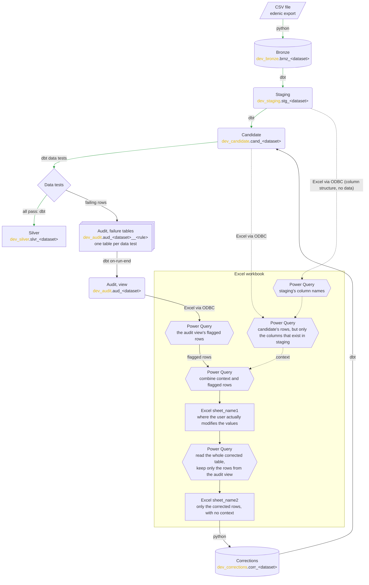

# Data flow

How a journal entry moves from the CSV file to silver, and how a correction comes back in.

## Legend

| Drawing | Meaning |
|---|---|
| Slanted box | A file outside the database |
| Cylinder | An input: a table filled from outside the warehouse |
| Rounded box | A view built by dbt |
| Rectangle | A table built by dbt |
| Stacked rectangle | Several tables of the same kind |
| Diamond | The gate: silver is built only when every data test passes |
| Frame | The Excel workbook, a file outside the database, and what is inside it |
| Hexagon | A Power Query query inside the workbook |
| Rectangle in the frame | A table in the workbook |
| Solid arrow | Data moves, and the label says what moves it |
| Dotted arrow | A dependency that is not part of the flow |
